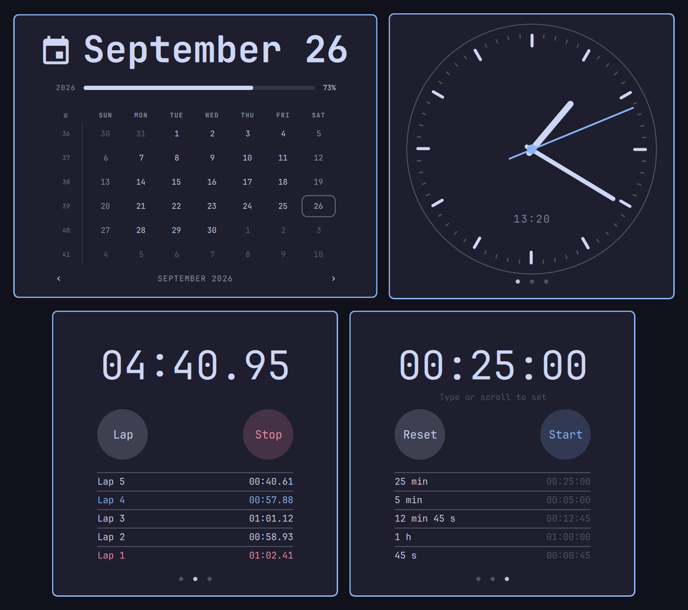

# Analogue Clock aka Better Calendar



Omarchy's bar clock, split in two:

- **Click the day** (`Saturday`) for the familiar calendar popup, exactly as on the stock clock.
- **Click the time** (`23:54`) for a minimalist analogue clock: square card, bare face, hour and
  minute hands, a slim accent-coloured second hand that **sweeps** (it moves every frame, it doesn't
  tick), and a small date window. No numerals, no chrome.

Both popups appear in the same spot and the bar hands over between them with its normal cross-fade,
so you can click from one half to the other. `Esc` closes either; `Tab` on the clock face flips to
the calendar.

The second hand only animates while the popup is open, so it costs nothing the rest of the time.

## Install

```bash
omarchy plugin add https://github.com/crazybadger/omarchy-split-clock.git
omarchy plugin enable crazybadger.split-clock
```

Enabling adds it to the bar (it lands after the weather widget). To have it replace the stock clock
in the same slot, edit `~/.config/omarchy/shell.json` and change `{ "id": "omarchy.clock" }` to
`{ "id": "crazybadger.split-clock" }` (your calendar settings, `birthYear` and so on, can stay on the
entry). `omarchy restart shell` after installing or after editing the plugin's code.

## Roll back

```bash
omarchy bar put omarchy.clock --before crazybadger.split-clock
omarchy plugin disable crazybadger.split-clock
```

The stock clock is back where it was.

## Uninstall

Roll back first (above) so the bar isn't left without a clock, then:

```bash
omarchy plugin remove crazybadger.split-clock
```

## Dependencies

None beyond Omarchy's own shell. No extra packages, no network access, nothing to build.

## Settings

Set these on the widget's entry in `~/.config/omarchy/shell.json` (they hot-reload):

```json
{ "id": "crazybadger.split-clock", "dayFormat": "ddd d MMM", "timeFormat": "HH:mm:ss", "secondHand": "sweep" }
```

| Key | Default | What |
|-----|---------|------|
| `dayFormat` | `"dddd"` | Label for the day button ([Qt date format](https://doc.qt.io/qt-6/qml-qtqml-qt.html#formatDateTime-method)). Right-click the day to cycle `dddd` / `ddd d MMM` / `d MMMM yyyy` / `dddd d`. |
| `timeFormat` | `"HH:mm"` | Label for the time button. Right-click the time to cycle `HH:mm` / `HH:mm:ss` / `h:mm AP`. |
| `secondHand` | `"sweep"` | `"sweep"` (smooth), `"tick"` (once a second) or `"off"`. |
| `verticalDayFormat`, `verticalTimeFormat` | `"ddd"`, `"HH\n—\nmm"` | Labels when the bar is on the left or right edge. |
| `weekStartDay`, `birthYear`, `lifeExpectancy` | | The calendar's own settings, unchanged from the stock clock. |

Middle-click either half opens Omarchy's timezone picker, as on the stock clock. Changing a format by
right-clicking writes it back to `shell.json`.

## IPC

```bash
omarchy-shell crazybadger.split-clock toggle       # calendar
omarchy-shell crazybadger.split-clock toggleFace   # analogue clock
omarchy-shell crazybadger.split-clock close        # whichever is open
```

Handy for a keybinding.

## Notes

- Tested on Omarchy 4.0.4 with a top bar (horizontal) and briefly with a left bar (vertical: `Sat`,
  `23`, `—`, `51`). Multi-monitor is not tested.
- Plugins are unsandboxed code: read it before you install it. It is three small QML files plus the
  stock calendar.
- The accent underline that marks an open popup sits under whichever half you clicked and slides
  across when you hop from one popup to the other. (The bar only draws that mark for a widget's
  primary popup, so this widget silences the bar's mark and draws its own in the same style.)
- Right-clicking a label writes `dayFormat` / `timeFormat` to this widget's entry in `shell.json`,
  as the stock clock does for its format. Nothing else in your configuration is touched.

## Credits

`CalendarPanel.qml` and `Model.js` are Omarchy's own clock panel (MIT, Copyright (c) David Heinemeier
Hansson), copied with only the plugin id changed. `BarWidget.qml` is adapted from Omarchy's clock
widget. `ClockPanel.qml` is new. See `LICENSE`.
